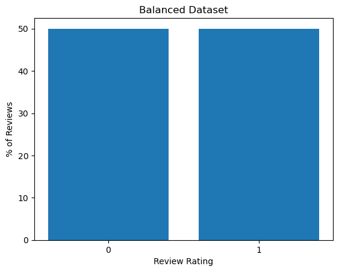
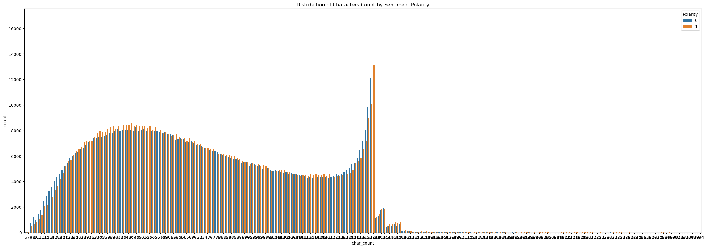
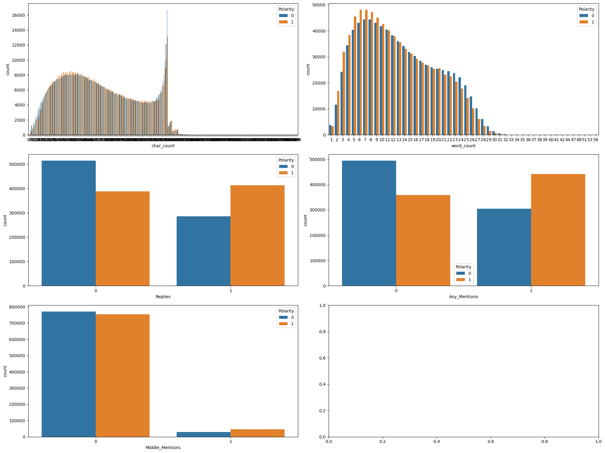
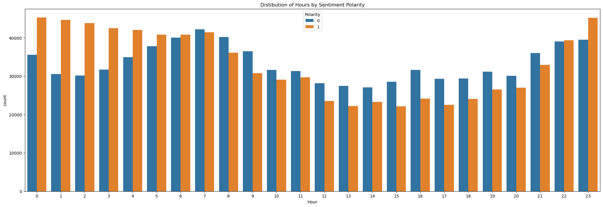

# EDA Notebook


```python
import numpy as np
import pandas as pd
import re
import seaborn as sns
import matplotlib.pyplot as plt
```


```python
colnames = ['Polarity','ID','Date','Query','User','Tweet']
df = pd.read_csv('../data/trainingandtestdata/training.1600000.processed.noemoticon.csv', names=colnames, encoding='latin-1')
```


```python
df.info()
```

    <class 'pandas.core.frame.DataFrame'>
    RangeIndex: 1600000 entries, 0 to 1599999
    Data columns (total 6 columns):
     #   Column    Non-Null Count    Dtype 
    ---  ------    --------------    ----- 
     0   Polarity  1600000 non-null  int64 
     1   ID        1600000 non-null  int64 
     2   Date      1600000 non-null  object
     3   Query     1600000 non-null  object
     4   User      1600000 non-null  object
     5   Tweet     1600000 non-null  object
    dtypes: int64(2), object(4)
    memory usage: 73.2+ MB


```python
df.head(10)
```


<div>
<style scoped>
    .dataframe tbody tr th:only-of-type {
        vertical-align: middle;
    }

    .dataframe tbody tr th {
        vertical-align: top;
    }

    .dataframe thead th {
        text-align: right;
    }
</style>
<table border="1" class="dataframe">
  <thead>
    <tr style="text-align: right;">
      <th></th>
      <th>Polarity</th>
      <th>ID</th>
      <th>Date</th>
      <th>Query</th>
      <th>User</th>
      <th>Tweet</th>
    </tr>
  </thead>
  <tbody>
    <tr>
      <th>0</th>
      <td>0</td>
      <td>1467810369</td>
      <td>Mon Apr 06 22:19:45 PDT 2009</td>
      <td>NO_QUERY</td>
      <td>_TheSpecialOne_</td>
      <td>@switchfoot http://twitpic.com/2y1zl - Awww, t...</td>
    </tr>
    <tr>
      <th>1</th>
      <td>0</td>
      <td>1467810672</td>
      <td>Mon Apr 06 22:19:49 PDT 2009</td>
      <td>NO_QUERY</td>
      <td>scotthamilton</td>
      <td>is upset that he can't update his Facebook by ...</td>
    </tr>
    <tr>
      <th>2</th>
      <td>0</td>
      <td>1467810917</td>
      <td>Mon Apr 06 22:19:53 PDT 2009</td>
      <td>NO_QUERY</td>
      <td>mattycus</td>
      <td>@Kenichan I dived many times for the ball. Man...</td>
    </tr>
    <tr>
      <th>3</th>
      <td>0</td>
      <td>1467811184</td>
      <td>Mon Apr 06 22:19:57 PDT 2009</td>
      <td>NO_QUERY</td>
      <td>ElleCTF</td>
      <td>my whole body feels itchy and like its on fire</td>
    </tr>
    <tr>
      <th>4</th>
      <td>0</td>
      <td>1467811193</td>
      <td>Mon Apr 06 22:19:57 PDT 2009</td>
      <td>NO_QUERY</td>
      <td>Karoli</td>
      <td>@nationwideclass no, it's not behaving at all....</td>
    </tr>
    <tr>
      <th>5</th>
      <td>0</td>
      <td>1467811372</td>
      <td>Mon Apr 06 22:20:00 PDT 2009</td>
      <td>NO_QUERY</td>
      <td>joy_wolf</td>
      <td>@Kwesidei not the whole crew</td>
    </tr>
    <tr>
      <th>6</th>
      <td>0</td>
      <td>1467811592</td>
      <td>Mon Apr 06 22:20:03 PDT 2009</td>
      <td>NO_QUERY</td>
      <td>mybirch</td>
      <td>Need a hug</td>
    </tr>
    <tr>
      <th>7</th>
      <td>0</td>
      <td>1467811594</td>
      <td>Mon Apr 06 22:20:03 PDT 2009</td>
      <td>NO_QUERY</td>
      <td>coZZ</td>
      <td>@LOLTrish hey  long time no see! Yes.. Rains a...</td>
    </tr>
    <tr>
      <th>8</th>
      <td>0</td>
      <td>1467811795</td>
      <td>Mon Apr 06 22:20:05 PDT 2009</td>
      <td>NO_QUERY</td>
      <td>2Hood4Hollywood</td>
      <td>@Tatiana_K nope they didn't have it</td>
    </tr>
    <tr>
      <th>9</th>
      <td>0</td>
      <td>1467812025</td>
      <td>Mon Apr 06 22:20:09 PDT 2009</td>
      <td>NO_QUERY</td>
      <td>mimismo</td>
      <td>@twittera que me muera ?</td>
    </tr>
  </tbody>
</table>
</div>


## Basic EDA 

### Missing Values - *None*


```python
# Columns / Features
df.isna().sum()
```


    Polarity    0
    ID          0
    Date        0
    Query       0
    User        0
    Tweet       0
    dtype: int64


```python
# Row / Observations
df.T.isna().sum().sum()
```


    0


```python
df2 = df.copy()
```

### Duplicates


```python
# Row
df2.duplicated().sum()
```


    0


#### Blank Spaces Entries


```python
(df2 == ' ').sum()
```


    Polarity    0
    ID          0
    Date        0
    Query       0
    User        0
    Tweet       0
    dtype: int64


No data duplicates were found.

## Target Variable

#### Sentiment Polarity Check


```python
# Replacing Sentiment Polarity to 0 & 1
df2['Polarity']= df2['Polarity'].replace(4,1)
```


```python
df2['Polarity'].value_counts()
```


    Polarity
    0    800000
    1    800000
    Name: count, dtype: int64


```python
# Class Imbalance - Balanced Dataset
df2.Polarity.value_counts(normalize=True)
```


    Polarity
    0    0.5
    1    0.5
    Name: proportion, dtype: float64


```python
values, counts = np.unique(df2['Polarity'], return_counts=True)
normalized_counts = counts/counts.sum()

plt.figure()
plt.bar(["0", "1"], normalized_counts*100) # plot normalized counts
plt.xlabel('Review Rating')
plt.ylabel('% of Reviews')
plt.title('Balanced Dataset')
plt.show()

print(f"Class imbalance: {np.round(normalized_counts, 2)}")
```


    

    


    Class imbalance: [0.5 0.5]


## Dependent Variables 

### ID Check


```python
df2.ID.value_counts()
```


    ID
    2190457769    2
    1972193428    2
    1989776729    2
    1989776908    2
    1564543229    2
                 ..
    2197311196    1
    2197311146    1
    2197310899    1
    2197310477    1
    2193602129    1
    Name: count, Length: 1598315, dtype: int64


```python
df2['ID'].value_counts().describe()
```


    count    1.598315e+06
    mean     1.001054e+00
    std      3.245188e-02
    min      1.000000e+00
    25%      1.000000e+00
    50%      1.000000e+00
    75%      1.000000e+00
    max      2.000000e+00
    Name: count, dtype: float64


__ID__
- There seems to be some IDs that have multiple entries


### User Check


```python
df2.User.value_counts().describe()
```


    count    659775.000000
    mean          2.425069
    std           4.710913
    min           1.000000
    25%           1.000000
    50%           1.000000
    75%           2.000000
    max         549.000000
    Name: count, dtype: float64


__Users__
- There seems to be some users with multiple tweets

### Query Check


```python
df2['Query'].value_counts()
```


    Query
    NO_QUERY    1600000
    Name: count, dtype: int64


### Date Engineering & Analysis

pd.to_datetime works easily on raw format for few sample size, but may take a long time for whole 1,600,000 entries. Thus, we will be splitting the string date/time column to convert into datetime format.

#### Checking PDT & Year '2009' - If Formatted The Same Throughout


```python
# Checking Timezone (PDT)
df2['Date'].str.rsplit(" ", n=3).str[2].value_counts()
```


    Date
    PDT    1600000
    Name: count, dtype: int64


```python
# Checking Year of Data
df2['Date'].str.rsplit(" ", n=3).str[3].value_counts()
```


    Date
    2009    1600000
    Name: count, dtype: int64


All Tweet Entries are formatted in Pacific Daylight Time (PDT) and extracted from 2009.

#### Creating Date & Time Columns


```python
df2['Year'] = df2['Date'].str.rsplit(" ", n=3).str[3].astype(int)
df2['Year']
```


    0          2009
    1          2009
    2          2009
    3          2009
    4          2009
               ... 
    1599995    2009
    1599996    2009
    1599997    2009
    1599998    2009
    1599999    2009
    Name: Year, Length: 1600000, dtype: int64


```python
df2['Timestamp'] = df2['Date'].str.rsplit(" ", n=3).str[1]
df2['Timestamp']
```


    0          22:19:45
    1          22:19:49
    2          22:19:53
    3          22:19:57
    4          22:19:57
                 ...   
    1599995    08:40:49
    1599996    08:40:49
    1599997    08:40:49
    1599998    08:40:49
    1599999    08:40:50
    Name: Timestamp, Length: 1600000, dtype: object


```python
df2['MonthDay'] = df2['Date'].str.rsplit(" ", n=3).str[0]
df2['MonthDay']
```


    0          Mon Apr 06
    1          Mon Apr 06
    2          Mon Apr 06
    3          Mon Apr 06
    4          Mon Apr 06
                  ...    
    1599995    Tue Jun 16
    1599996    Tue Jun 16
    1599997    Tue Jun 16
    1599998    Tue Jun 16
    1599999    Tue Jun 16
    Name: MonthDay, Length: 1600000, dtype: object


```python
df2['MonthDay'] = pd.to_datetime('2009 ' + df2['MonthDay'], format='%Y %a %b %d')
df2['MonthDay']
```


    0         2009-04-06
    1         2009-04-06
    2         2009-04-06
    3         2009-04-06
    4         2009-04-06
                 ...    
    1599995   2009-06-16
    1599996   2009-06-16
    1599997   2009-06-16
    1599998   2009-06-16
    1599999   2009-06-16
    Name: MonthDay, Length: 1600000, dtype: datetime64[ns]


```python
# df2['MonthDay'] = pd.to_datetime('2019 ' + df2['MonthDay'], format='%Y %a %b %d')
```


```python
# df2['Date'] = df2['MonthDay'] + ' ' + df2['Year']
```


```python
df2['Hour'] = df2['Timestamp'].str[:2].astype(int)
df2['Hour']
```


    0          22
    1          22
    2          22
    3          22
    4          22
               ..
    1599995     8
    1599996     8
    1599997     8
    1599998     8
    1599999     8
    Name: Hour, Length: 1600000, dtype: int64


```python
# df2['Hour'] = df2['Timestamp'].astype(str).str[:2].astype(int)
```


```python
# df2['Timestamp'] = pd.to_datetime(df2['Timestamp']).dt.time
```


```python
#df2['Date'] = pd.to_datetime(df2['Date'])
```


```python
df2.head()
```


<div>
<style scoped>
    .dataframe tbody tr th:only-of-type {
        vertical-align: middle;
    }

    .dataframe tbody tr th {
        vertical-align: top;
    }

    .dataframe thead th {
        text-align: right;
    }
</style>
<table border="1" class="dataframe">
  <thead>
    <tr style="text-align: right;">
      <th></th>
      <th>Polarity</th>
      <th>ID</th>
      <th>Date</th>
      <th>Query</th>
      <th>User</th>
      <th>Tweet</th>
      <th>Year</th>
      <th>Timestamp</th>
      <th>MonthDay</th>
      <th>Hour</th>
    </tr>
  </thead>
  <tbody>
    <tr>
      <th>0</th>
      <td>0</td>
      <td>1467810369</td>
      <td>Mon Apr 06 22:19:45 PDT 2009</td>
      <td>NO_QUERY</td>
      <td>_TheSpecialOne_</td>
      <td>@switchfoot http://twitpic.com/2y1zl - Awww, t...</td>
      <td>2009</td>
      <td>22:19:45</td>
      <td>04-06</td>
      <td>22</td>
    </tr>
    <tr>
      <th>1</th>
      <td>0</td>
      <td>1467810672</td>
      <td>Mon Apr 06 22:19:49 PDT 2009</td>
      <td>NO_QUERY</td>
      <td>scotthamilton</td>
      <td>is upset that he can't update his Facebook by ...</td>
      <td>2009</td>
      <td>22:19:49</td>
      <td>04-06</td>
      <td>22</td>
    </tr>
    <tr>
      <th>2</th>
      <td>0</td>
      <td>1467810917</td>
      <td>Mon Apr 06 22:19:53 PDT 2009</td>
      <td>NO_QUERY</td>
      <td>mattycus</td>
      <td>@Kenichan I dived many times for the ball. Man...</td>
      <td>2009</td>
      <td>22:19:53</td>
      <td>04-06</td>
      <td>22</td>
    </tr>
    <tr>
      <th>3</th>
      <td>0</td>
      <td>1467811184</td>
      <td>Mon Apr 06 22:19:57 PDT 2009</td>
      <td>NO_QUERY</td>
      <td>ElleCTF</td>
      <td>my whole body feels itchy and like its on fire</td>
      <td>2009</td>
      <td>22:19:57</td>
      <td>04-06</td>
      <td>22</td>
    </tr>
    <tr>
      <th>4</th>
      <td>0</td>
      <td>1467811193</td>
      <td>Mon Apr 06 22:19:57 PDT 2009</td>
      <td>NO_QUERY</td>
      <td>Karoli</td>
      <td>@nationwideclass no, it's not behaving at all....</td>
      <td>2009</td>
      <td>22:19:57</td>
      <td>04-06</td>
      <td>22</td>
    </tr>
  </tbody>
</table>
</div>


#### Date Analysis


```python
pd.to_datetime('2019 ' + df2['MonthDay'], format='%Y %m/%d').dt.strftime('%m %d')
```


    0          04 06
    1          04 06
    2          04 06
    3          04 06
    4          04 06
               ...  
    1599995    06 16
    1599996    06 16
    1599997    06 16
    1599998    06 16
    1599999    06 16
    Name: MonthDay, Length: 1600000, dtype: object


```python
df2['MonthDay'].describe()
```


    count     1600000
    unique         48
    top         06/06
    freq       111676
    Name: MonthDay, dtype: object


```python
my_tickvals = pd.to_datetime('2019 ' + df2['MonthDay'], format='%Y %m/%d').unique().tolist()
my_ticktext = [md.strftime("%m %d") for md in my_tickvals]
```


```python
import plotly.express as px
fig = px.histogram(df2, x='MonthDay')
fig.show()
```


```python
# date distribution by polarity
fig = px.histogram(df2, x='MonthDay', color="Polarity",
                   hover_data=df2.columns)
fig.show()
```

__Date__

2009 dataset
04/06 - 06/25 : 3 months period in 2009. 

- Gaps can be seen in the dates, meaning that the tweets were not extracted consistently over the time period.


### Tweets Check

####  Character Cleaning


```python
df2['Tweet'].head(25)
```


    0     @switchfoot http://twitpic.com/2y1zl - Awww, t...
    1     is upset that he can't update his Facebook by ...
    2     @Kenichan I dived many times for the ball. Man...
    3       my whole body feels itchy and like its on fire 
    4     @nationwideclass no, it's not behaving at all....
    5                         @Kwesidei not the whole crew 
    6                                           Need a hug 
    7     @LOLTrish hey  long time no see! Yes.. Rains a...
    8                  @Tatiana_K nope they didn't have it 
    9                             @twittera que me muera ? 
    10          spring break in plain city... it's snowing 
    11                           I just re-pierced my ears 
    12    @caregiving I couldn't bear to watch it.  And ...
    13    @octolinz16 It it counts, idk why I did either...
    14    @smarrison i would've been the first, but i di...
    15    @iamjazzyfizzle I wish I got to watch it with ...
    16    Hollis' death scene will hurt me severely to w...
    17                                 about to file taxes 
    18    @LettyA ahh ive always wanted to see rent  lov...
    19    @FakerPattyPattz Oh dear. Were you drinking ou...
    20    @alydesigns i was out most of the day so didn'...
    21    one of my friend called me, and asked to meet ...
    22     @angry_barista I baked you a cake but I ated it 
    23               this week is not going as i had hoped 
    24                           blagh class at 8 tomorrow 
    Name: Tweet, dtype: object


#### HTML Special Entities

#### Removing HTML Special Entities


```python
df2[df2['Tweet'].str.contains(r'(&[a-z]*;)')].Tweet
```

    /var/folders/rg/vhzzp1595k139x9jjsx9yg5m0000gn/T/ipykernel_41424/3563776776.py:1: UserWarning:
    
    This pattern is interpreted as a regular expression, and has match groups. To actually get the groups, use str.extract.
    


    103                              watching &quot;House&quot; 
    119        @eRRe_sC aaw i miss ya all too.. im leaving to...
    124        Late night snack, glass of OJ b/c I'm &quot;do...
    145        @twista202 I still haven't read the 9th&amp;10...
    183        Downloading NIN's new album &quot;the slip&quo...
                                     ...                        
    1599954    God works mysteriously!i learn that if u think...
    1599965    @stum450n Hi. Thanks for the follow. Nice webs...
    1599970    Thanks @eastwestchic &amp; @wangyip Thanks! Th...
    1599977    @MayorDorisWolfe Thats my girl - dishing out t...
    1599985    if ur the lead singer in a band, beware fallin...
    Name: Tweet, Length: 94458, dtype: object


```python
df2[df2['Tweet'].str.contains(r'(&[a-z]*;)+ ')].Tweet
```

    /var/folders/rg/vhzzp1595k139x9jjsx9yg5m0000gn/T/ipykernel_41424/237845437.py:1: UserWarning:
    
    This pattern is interpreted as a regular expression, and has match groups. To actually get the groups, use str.extract.
    


    103                              watching &quot;House&quot; 
    119        @eRRe_sC aaw i miss ya all too.. im leaving to...
    183        Downloading NIN's new album &quot;the slip&quo...
    206        My mind and body are severely protesting this ...
    213        Awwh babs... you look so sad underneith that s...
                                     ...                        
    1599954    God works mysteriously!i learn that if u think...
    1599965    @stum450n Hi. Thanks for the follow. Nice webs...
    1599970    Thanks @eastwestchic &amp; @wangyip Thanks! Th...
    1599977    @MayorDorisWolfe Thats my girl - dishing out t...
    1599985    if ur the lead singer in a band, beware fallin...
    Name: Tweet, Length: 68521, dtype: object


```python
import re
```


```python
df2['Tweet'].str.count(r'(&[a-z]*;)')
```


    0          0
    1          0
    2          0
    3          0
    4          0
              ..
    1599995    0
    1599996    0
    1599997    0
    1599998    0
    1599999    0
    Name: Tweet, Length: 1600000, dtype: int64


```python
df2['Tweet'].str.count(r'(&[a-z]*;)').sum()
```


    146413


```python
df2[df2['Tweet'].str.count(r'(&[a-z]*;)')>0]
```


<div>
<style scoped>
    .dataframe tbody tr th:only-of-type {
        vertical-align: middle;
    }

    .dataframe tbody tr th {
        vertical-align: top;
    }

    .dataframe thead th {
        text-align: right;
    }
</style>
<table border="1" class="dataframe">
  <thead>
    <tr style="text-align: right;">
      <th></th>
      <th>Polarity</th>
      <th>ID</th>
      <th>Date</th>
      <th>Query</th>
      <th>User</th>
      <th>Tweet</th>
      <th>Year</th>
      <th>Timestamp</th>
      <th>MonthDay</th>
      <th>Hour</th>
    </tr>
  </thead>
  <tbody>
    <tr>
      <th>103</th>
      <td>0</td>
      <td>1467837470</td>
      <td>Mon Apr 06 22:26:43 PDT 2009</td>
      <td>NO_QUERY</td>
      <td>annette414</td>
      <td>watching &amp;quot;House&amp;quot;</td>
      <td>2009</td>
      <td>22:26:43</td>
      <td>2009-04-06</td>
      <td>22</td>
    </tr>
    <tr>
      <th>119</th>
      <td>0</td>
      <td>1467839586</td>
      <td>Mon Apr 06 22:27:18 PDT 2009</td>
      <td>NO_QUERY</td>
      <td>sonyolmos</td>
      <td>@eRRe_sC aaw i miss ya all too.. im leaving to...</td>
      <td>2009</td>
      <td>22:27:18</td>
      <td>2009-04-06</td>
      <td>22</td>
    </tr>
    <tr>
      <th>124</th>
      <td>0</td>
      <td>1467840552</td>
      <td>Mon Apr 06 22:27:34 PDT 2009</td>
      <td>NO_QUERY</td>
      <td>weefranniev</td>
      <td>Late night snack, glass of OJ b/c I'm &amp;quot;do...</td>
      <td>2009</td>
      <td>22:27:34</td>
      <td>2009-04-06</td>
      <td>22</td>
    </tr>
    <tr>
      <th>145</th>
      <td>0</td>
      <td>1467843647</td>
      <td>Mon Apr 06 22:28:24 PDT 2009</td>
      <td>NO_QUERY</td>
      <td>treehugger25</td>
      <td>@twista202 I still haven't read the 9th&amp;amp;10...</td>
      <td>2009</td>
      <td>22:28:24</td>
      <td>2009-04-06</td>
      <td>22</td>
    </tr>
    <tr>
      <th>183</th>
      <td>0</td>
      <td>1467858363</td>
      <td>Mon Apr 06 22:32:12 PDT 2009</td>
      <td>NO_QUERY</td>
      <td>schammy</td>
      <td>Downloading NIN's new album &amp;quot;the slip&amp;quo...</td>
      <td>2009</td>
      <td>22:32:12</td>
      <td>2009-04-06</td>
      <td>22</td>
    </tr>
    <tr>
      <th>...</th>
      <td>...</td>
      <td>...</td>
      <td>...</td>
      <td>...</td>
      <td>...</td>
      <td>...</td>
      <td>...</td>
      <td>...</td>
      <td>...</td>
      <td>...</td>
    </tr>
    <tr>
      <th>1599954</th>
      <td>1</td>
      <td>2193577602</td>
      <td>Tue Jun 16 08:38:51 PDT 2009</td>
      <td>NO_QUERY</td>
      <td>charitojoy</td>
      <td>God works mysteriously!i learn that if u think...</td>
      <td>2009</td>
      <td>08:38:51</td>
      <td>2009-06-16</td>
      <td>8</td>
    </tr>
    <tr>
      <th>1599965</th>
      <td>1</td>
      <td>2193577918</td>
      <td>Tue Jun 16 08:38:53 PDT 2009</td>
      <td>NO_QUERY</td>
      <td>milliontwits</td>
      <td>@stum450n Hi. Thanks for the follow. Nice webs...</td>
      <td>2009</td>
      <td>08:38:53</td>
      <td>2009-06-16</td>
      <td>8</td>
    </tr>
    <tr>
      <th>1599970</th>
      <td>1</td>
      <td>2193578196</td>
      <td>Tue Jun 16 08:38:54 PDT 2009</td>
      <td>NO_QUERY</td>
      <td>adbillingsley</td>
      <td>Thanks @eastwestchic &amp;amp; @wangyip Thanks! Th...</td>
      <td>2009</td>
      <td>08:38:54</td>
      <td>2009-06-16</td>
      <td>8</td>
    </tr>
    <tr>
      <th>1599977</th>
      <td>1</td>
      <td>2193578386</td>
      <td>Tue Jun 16 08:38:55 PDT 2009</td>
      <td>NO_QUERY</td>
      <td>TeamUKskyvixen</td>
      <td>@MayorDorisWolfe Thats my girl - dishing out t...</td>
      <td>2009</td>
      <td>08:38:55</td>
      <td>2009-06-16</td>
      <td>8</td>
    </tr>
    <tr>
      <th>1599985</th>
      <td>1</td>
      <td>2193578982</td>
      <td>Tue Jun 16 08:38:58 PDT 2009</td>
      <td>NO_QUERY</td>
      <td>LISKFEST</td>
      <td>if ur the lead singer in a band, beware fallin...</td>
      <td>2009</td>
      <td>08:38:58</td>
      <td>2009-06-16</td>
      <td>8</td>
    </tr>
  </tbody>
</table>
<p>94458 rows × 10 columns</p>
</div>


```python
df2['Tweet_1'] = df2['Tweet'].str.replace(r'(&[a-z]*;)+', '', regex=True)
```


```python
df2['Tweet_1'].str.count(r'(&[a-z]*;)').sum()
```


    0


#### Removing HTML Links & Making Any_URL Binary


```python
df2[df2['Tweet_1'].str.contains(r'http:\S+')].Tweet_1

```


    0          @switchfoot http://twitpic.com/2y1zl - Awww, t...
    37         @MissXu sorry! bed time came here (GMT+1)   ht...
    50         Broadband plan 'a massive broken promise' http...
    74         Why won't you show my location?!   http://twit...
    95         Strider is a sick little puppy  http://apps.fa...
                                     ...                        
    1599961    @crgrs359 Skip the aquarium and check out thes...
    1599973    http://twitpic.com/7jp4n - OMG! Office Space.....
    1599981    Another Commenting Contest! [;: Yay!!!  http:/...
    1599985    if ur the lead singer in a band, beware fallin...
    1599996    TheWDB.com - Very cool to hear old Walt interv...
    Name: Tweet_1, Length: 70082, dtype: object


```python
df2['Any_URL'] = df2['Tweet_1'].str.contains(r'http:\S+').astype(int)
```


```python
df2[df2.Any_URL == 1]
```


<div>
<style scoped>
    .dataframe tbody tr th:only-of-type {
        vertical-align: middle;
    }

    .dataframe tbody tr th {
        vertical-align: top;
    }

    .dataframe thead th {
        text-align: right;
    }
</style>
<table border="1" class="dataframe">
  <thead>
    <tr style="text-align: right;">
      <th></th>
      <th>Polarity</th>
      <th>ID</th>
      <th>Date</th>
      <th>Query</th>
      <th>User</th>
      <th>Tweet</th>
      <th>Year</th>
      <th>Timestamp</th>
      <th>MonthDay</th>
      <th>Hour</th>
      <th>Tweet_1</th>
      <th>Any_URL</th>
    </tr>
  </thead>
  <tbody>
    <tr>
      <th>0</th>
      <td>0</td>
      <td>1467810369</td>
      <td>Mon Apr 06 22:19:45 PDT 2009</td>
      <td>NO_QUERY</td>
      <td>_TheSpecialOne_</td>
      <td>@switchfoot http://twitpic.com/2y1zl - Awww, t...</td>
      <td>2009</td>
      <td>22:19:45</td>
      <td>2009-04-06</td>
      <td>22</td>
      <td>@switchfoot http://twitpic.com/2y1zl - Awww, t...</td>
      <td>1</td>
    </tr>
    <tr>
      <th>37</th>
      <td>0</td>
      <td>1467817374</td>
      <td>Mon Apr 06 22:21:30 PDT 2009</td>
      <td>NO_QUERY</td>
      <td>ajaxpro</td>
      <td>@MissXu sorry! bed time came here (GMT+1)   ht...</td>
      <td>2009</td>
      <td>22:21:30</td>
      <td>2009-04-06</td>
      <td>22</td>
      <td>@MissXu sorry! bed time came here (GMT+1)   ht...</td>
      <td>1</td>
    </tr>
    <tr>
      <th>50</th>
      <td>0</td>
      <td>1467820863</td>
      <td>Mon Apr 06 22:22:23 PDT 2009</td>
      <td>NO_QUERY</td>
      <td>tautao</td>
      <td>Broadband plan 'a massive broken promise' http...</td>
      <td>2009</td>
      <td>22:22:23</td>
      <td>2009-04-06</td>
      <td>22</td>
      <td>Broadband plan 'a massive broken promise' http...</td>
      <td>1</td>
    </tr>
    <tr>
      <th>74</th>
      <td>0</td>
      <td>1467826052</td>
      <td>Mon Apr 06 22:23:45 PDT 2009</td>
      <td>NO_QUERY</td>
      <td>paulseverio</td>
      <td>Why won't you show my location?!   http://twit...</td>
      <td>2009</td>
      <td>22:23:45</td>
      <td>2009-04-06</td>
      <td>22</td>
      <td>Why won't you show my location?!   http://twit...</td>
      <td>1</td>
    </tr>
    <tr>
      <th>95</th>
      <td>0</td>
      <td>1467836448</td>
      <td>Mon Apr 06 22:26:27 PDT 2009</td>
      <td>NO_QUERY</td>
      <td>Dogbook</td>
      <td>Strider is a sick little puppy  http://apps.fa...</td>
      <td>2009</td>
      <td>22:26:27</td>
      <td>2009-04-06</td>
      <td>22</td>
      <td>Strider is a sick little puppy  http://apps.fa...</td>
      <td>1</td>
    </tr>
    <tr>
      <th>...</th>
      <td>...</td>
      <td>...</td>
      <td>...</td>
      <td>...</td>
      <td>...</td>
      <td>...</td>
      <td>...</td>
      <td>...</td>
      <td>...</td>
      <td>...</td>
      <td>...</td>
      <td>...</td>
    </tr>
    <tr>
      <th>1599961</th>
      <td>1</td>
      <td>2193577828</td>
      <td>Tue Jun 16 08:38:52 PDT 2009</td>
      <td>NO_QUERY</td>
      <td>ogreenthumb</td>
      <td>@crgrs359 Skip the aquarium and check out thes...</td>
      <td>2009</td>
      <td>08:38:52</td>
      <td>2009-06-16</td>
      <td>8</td>
      <td>@crgrs359 Skip the aquarium and check out thes...</td>
      <td>1</td>
    </tr>
    <tr>
      <th>1599973</th>
      <td>1</td>
      <td>2193578319</td>
      <td>Tue Jun 16 08:38:55 PDT 2009</td>
      <td>NO_QUERY</td>
      <td>luckygeorgeblog</td>
      <td>http://twitpic.com/7jp4n - OMG! Office Space.....</td>
      <td>2009</td>
      <td>08:38:55</td>
      <td>2009-06-16</td>
      <td>8</td>
      <td>http://twitpic.com/7jp4n - OMG! Office Space.....</td>
      <td>1</td>
    </tr>
    <tr>
      <th>1599981</th>
      <td>1</td>
      <td>2193578716</td>
      <td>Tue Jun 16 08:38:57 PDT 2009</td>
      <td>NO_QUERY</td>
      <td>youtubelatest</td>
      <td>Another Commenting Contest! [;: Yay!!!  http:/...</td>
      <td>2009</td>
      <td>08:38:57</td>
      <td>2009-06-16</td>
      <td>8</td>
      <td>Another Commenting Contest! [;: Yay!!!  http:/...</td>
      <td>1</td>
    </tr>
    <tr>
      <th>1599985</th>
      <td>1</td>
      <td>2193578982</td>
      <td>Tue Jun 16 08:38:58 PDT 2009</td>
      <td>NO_QUERY</td>
      <td>LISKFEST</td>
      <td>if ur the lead singer in a band, beware fallin...</td>
      <td>2009</td>
      <td>08:38:58</td>
      <td>2009-06-16</td>
      <td>8</td>
      <td>if ur the lead singer in a band, beware fallin...</td>
      <td>1</td>
    </tr>
    <tr>
      <th>1599996</th>
      <td>1</td>
      <td>2193601969</td>
      <td>Tue Jun 16 08:40:49 PDT 2009</td>
      <td>NO_QUERY</td>
      <td>TheWDBoards</td>
      <td>TheWDB.com - Very cool to hear old Walt interv...</td>
      <td>2009</td>
      <td>08:40:49</td>
      <td>2009-06-16</td>
      <td>8</td>
      <td>TheWDB.com - Very cool to hear old Walt interv...</td>
      <td>1</td>
    </tr>
  </tbody>
</table>
<p>70082 rows × 12 columns</p>
</div>


```python
# Removing URL/Links
df2['Tweet_2'] = df2['Tweet_1'].str.replace(r'http:\S+', '', regex=True)
```

#### Mentions


```python
df2.head()
```


<div>
<style scoped>
    .dataframe tbody tr th:only-of-type {
        vertical-align: middle;
    }

    .dataframe tbody tr th {
        vertical-align: top;
    }

    .dataframe thead th {
        text-align: right;
    }
</style>
<table border="1" class="dataframe">
  <thead>
    <tr style="text-align: right;">
      <th></th>
      <th>Polarity</th>
      <th>ID</th>
      <th>Date</th>
      <th>Query</th>
      <th>User</th>
      <th>Tweet</th>
      <th>Year</th>
      <th>Timestamp</th>
      <th>MonthDay</th>
      <th>Hour</th>
      <th>Tweet_1</th>
      <th>Any_URL</th>
      <th>Tweet_2</th>
    </tr>
  </thead>
  <tbody>
    <tr>
      <th>0</th>
      <td>0</td>
      <td>1467810369</td>
      <td>Mon Apr 06 22:19:45 PDT 2009</td>
      <td>NO_QUERY</td>
      <td>_TheSpecialOne_</td>
      <td>@switchfoot http://twitpic.com/2y1zl - Awww, t...</td>
      <td>2009</td>
      <td>22:19:45</td>
      <td>2009-04-06</td>
      <td>22</td>
      <td>@switchfoot http://twitpic.com/2y1zl - Awww, t...</td>
      <td>1</td>
      <td>@switchfoot  - Awww, that's a bummer.  You sho...</td>
    </tr>
    <tr>
      <th>1</th>
      <td>0</td>
      <td>1467810672</td>
      <td>Mon Apr 06 22:19:49 PDT 2009</td>
      <td>NO_QUERY</td>
      <td>scotthamilton</td>
      <td>is upset that he can't update his Facebook by ...</td>
      <td>2009</td>
      <td>22:19:49</td>
      <td>2009-04-06</td>
      <td>22</td>
      <td>is upset that he can't update his Facebook by ...</td>
      <td>0</td>
      <td>is upset that he can't update his Facebook by ...</td>
    </tr>
    <tr>
      <th>2</th>
      <td>0</td>
      <td>1467810917</td>
      <td>Mon Apr 06 22:19:53 PDT 2009</td>
      <td>NO_QUERY</td>
      <td>mattycus</td>
      <td>@Kenichan I dived many times for the ball. Man...</td>
      <td>2009</td>
      <td>22:19:53</td>
      <td>2009-04-06</td>
      <td>22</td>
      <td>@Kenichan I dived many times for the ball. Man...</td>
      <td>0</td>
      <td>@Kenichan I dived many times for the ball. Man...</td>
    </tr>
    <tr>
      <th>3</th>
      <td>0</td>
      <td>1467811184</td>
      <td>Mon Apr 06 22:19:57 PDT 2009</td>
      <td>NO_QUERY</td>
      <td>ElleCTF</td>
      <td>my whole body feels itchy and like its on fire</td>
      <td>2009</td>
      <td>22:19:57</td>
      <td>2009-04-06</td>
      <td>22</td>
      <td>my whole body feels itchy and like its on fire</td>
      <td>0</td>
      <td>my whole body feels itchy and like its on fire</td>
    </tr>
    <tr>
      <th>4</th>
      <td>0</td>
      <td>1467811193</td>
      <td>Mon Apr 06 22:19:57 PDT 2009</td>
      <td>NO_QUERY</td>
      <td>Karoli</td>
      <td>@nationwideclass no, it's not behaving at all....</td>
      <td>2009</td>
      <td>22:19:57</td>
      <td>2009-04-06</td>
      <td>22</td>
      <td>@nationwideclass no, it's not behaving at all....</td>
      <td>0</td>
      <td>@nationwideclass no, it's not behaving at all....</td>
    </tr>
  </tbody>
</table>
</div>


A username can only contain alphanumeric characters with exception of underscores

#### Grouping Replies (Starting Mentions)


```python
df2['Tweet_2']
```


    0          @switchfoot  - Awww, that's a bummer.  You sho...
    1          is upset that he can't update his Facebook by ...
    2          @Kenichan I dived many times for the ball. Man...
    3            my whole body feels itchy and like its on fire 
    4          @nationwideclass no, it's not behaving at all....
                                     ...                        
    1599995    Just woke up. Having no school is the best fee...
    1599996    TheWDB.com - Very cool to hear old Walt interv...
    1599997    Are you ready for your MoJo Makeover? Ask me f...
    1599998    Happy 38th Birthday to my boo of alll time!!! ...
    1599999    happy #charitytuesday @theNSPCC @SparksCharity...
    Name: Tweet_2, Length: 1600000, dtype: object


```python
df2['Replies'] = df2['Tweet_2'].str.startswith('@')
df2['Replies'].value_counts()
```


    Replies
    False    901821
    True     698179
    Name: count, dtype: int64


```python
df2.Replies = df2.Replies.astype(int)
```

#### Grouping Any Mentions


```python
df2['Any_Mentions'] = df2['Tweet_2'].str.contains(r'(@\w*)+ |(@\w*)+')
df2['Any_Mentions'].value_counts()
```

    /var/folders/rg/vhzzp1595k139x9jjsx9yg5m0000gn/T/ipykernel_41424/349635612.py:1: UserWarning:
    
    This pattern is interpreted as a regular expression, and has match groups. To actually get the groups, use str.extract.
    


    Any_Mentions
    False    853579
    True     746421
    Name: count, dtype: int64


```python
df2['Any_Mentions'] = df2['Any_Mentions'].astype(int)
```

#### double checking on above without '+'


```python
df2['Tweet_2'].str.contains(r'(@\w*) |(@\w*)').value_counts()
```

    /var/folders/rg/vhzzp1595k139x9jjsx9yg5m0000gn/T/ipykernel_41424/1794741575.py:1: UserWarning:
    
    This pattern is interpreted as a regular expression, and has match groups. To actually get the groups, use str.extract.
    


    Tweet_2
    False    853579
    True     746421
    Name: count, dtype: int64


#### Grouping Middle Mentions


```python
df2['Tweet_2'].str.contains(r' (@\w*)| \w*(@\w*)').value_counts()
```

    /var/folders/rg/vhzzp1595k139x9jjsx9yg5m0000gn/T/ipykernel_41424/108969438.py:1: UserWarning:
    
    This pattern is interpreted as a regular expression, and has match groups. To actually get the groups, use str.extract.
    


    Tweet_2
    False    1524116
    True       75884
    Name: count, dtype: int64


```python
# checking with '+'
df2['Tweet_2'].str.contains(r' (@\w*)+| \w*(@\w*)+').value_counts()
```

    /var/folders/rg/vhzzp1595k139x9jjsx9yg5m0000gn/T/ipykernel_41424/2628059141.py:2: UserWarning:
    
    This pattern is interpreted as a regular expression, and has match groups. To actually get the groups, use str.extract.
    


    Tweet_2
    False    1524116
    True       75884
    Name: count, dtype: int64


```python
df2['Middle_Mentions'] = df2['Tweet_2'].str.contains(r' (@\w*)| \w*(@\w*)').astype(int)
```

    /var/folders/rg/vhzzp1595k139x9jjsx9yg5m0000gn/T/ipykernel_41424/3627789473.py:1: UserWarning:
    
    This pattern is interpreted as a regular expression, and has match groups. To actually get the groups, use str.extract.
    


#### Removing Mentions


```python
df2['Tweet_2'] = df2['Tweet_2'].str.replace(r'(@\w*)+', '', regex=True)

```


```python
#### Hashtags
```


```python
def hashtag_extract(x):
    hashtags = []    # Loop over the words in the tweet
    for i in x:
        ht = re.findall(r"#(\w+)", i)
        hashtags.append(ht)
    return hashtags
```

#### Removing Special Characters

If there's time -> look into how to separate misspelled words with punctuations ie: 'hilarious..so funny'

if statement?
if str.contains(r'[\.,!]\w') then -> put whitespace inbetween


```python
df2['Tweet_3'] = df2['Tweet_2'].str.replace(r'[^a-zA-Z0-9 ]', '', regex=True)
```

#### Removing Double Spacings


```python
df2['Tweet_3'] = df2['Tweet_3'].str.replace(r'(  )|(   )', ' ', regex=True)
```

#### Character & Word Count


```python
df2['char_count']= [len(i) for i in df2['Tweet']]

df2['char_count']
```


    0          115
    1          111
    2           89
    3           47
    4          111
              ... 
    1599995     56
    1599996     78
    1599997     57
    1599998     65
    1599999     62
    Name: char_count, Length: 1600000, dtype: int64


```python
df2.describe()
```


<div>
<style scoped>
    .dataframe tbody tr th:only-of-type {
        vertical-align: middle;
    }

    .dataframe tbody tr th {
        vertical-align: top;
    }

    .dataframe thead th {
        text-align: right;
    }
</style>
<table border="1" class="dataframe">
  <thead>
    <tr style="text-align: right;">
      <th></th>
      <th>Polarity</th>
      <th>ID</th>
      <th>Year</th>
      <th>MonthDay</th>
      <th>Hour</th>
      <th>Any_URL</th>
      <th>Replies</th>
      <th>Any_Mentions</th>
      <th>Middle_Mentions</th>
      <th>char_count</th>
    </tr>
  </thead>
  <tbody>
    <tr>
      <th>count</th>
      <td>1600000.0</td>
      <td>1.600000e+06</td>
      <td>1600000.0</td>
      <td>1600000</td>
      <td>1.600000e+06</td>
      <td>1.600000e+06</td>
      <td>1.600000e+06</td>
      <td>1.600000e+06</td>
      <td>1.600000e+06</td>
      <td>1.600000e+06</td>
    </tr>
    <tr>
      <th>mean</th>
      <td>0.5</td>
      <td>1.998818e+09</td>
      <td>2009.0</td>
      <td>2009-05-30 19:58:46.001999616</td>
      <td>1.096033e+01</td>
      <td>4.380125e-02</td>
      <td>4.363619e-01</td>
      <td>4.665131e-01</td>
      <td>4.742750e-02</td>
      <td>7.409011e+01</td>
    </tr>
    <tr>
      <th>min</th>
      <td>0.0</td>
      <td>1.467810e+09</td>
      <td>2009.0</td>
      <td>2009-04-06 00:00:00</td>
      <td>0.000000e+00</td>
      <td>0.000000e+00</td>
      <td>0.000000e+00</td>
      <td>0.000000e+00</td>
      <td>0.000000e+00</td>
      <td>6.000000e+00</td>
    </tr>
    <tr>
      <th>25%</th>
      <td>0.0</td>
      <td>1.956916e+09</td>
      <td>2009.0</td>
      <td>2009-05-28 00:00:00</td>
      <td>5.000000e+00</td>
      <td>0.000000e+00</td>
      <td>0.000000e+00</td>
      <td>0.000000e+00</td>
      <td>0.000000e+00</td>
      <td>4.400000e+01</td>
    </tr>
    <tr>
      <th>50%</th>
      <td>0.5</td>
      <td>2.002102e+09</td>
      <td>2009.0</td>
      <td>2009-06-02 00:00:00</td>
      <td>1.000000e+01</td>
      <td>0.000000e+00</td>
      <td>0.000000e+00</td>
      <td>0.000000e+00</td>
      <td>0.000000e+00</td>
      <td>6.900000e+01</td>
    </tr>
    <tr>
      <th>75%</th>
      <td>1.0</td>
      <td>2.177059e+09</td>
      <td>2009.0</td>
      <td>2009-06-15 00:00:00</td>
      <td>1.800000e+01</td>
      <td>0.000000e+00</td>
      <td>1.000000e+00</td>
      <td>1.000000e+00</td>
      <td>0.000000e+00</td>
      <td>1.040000e+02</td>
    </tr>
    <tr>
      <th>max</th>
      <td>1.0</td>
      <td>2.329206e+09</td>
      <td>2009.0</td>
      <td>2009-06-25 00:00:00</td>
      <td>2.300000e+01</td>
      <td>1.000000e+00</td>
      <td>1.000000e+00</td>
      <td>1.000000e+00</td>
      <td>1.000000e+00</td>
      <td>3.740000e+02</td>
    </tr>
    <tr>
      <th>std</th>
      <td>0.5</td>
      <td>1.935761e+08</td>
      <td>0.0</td>
      <td>NaN</td>
      <td>7.216392e+00</td>
      <td>2.046527e-01</td>
      <td>4.959338e-01</td>
      <td>4.988775e-01</td>
      <td>2.125515e-01</td>
      <td>3.644114e+01</td>
    </tr>
  </tbody>
</table>
</div>


```python
#check space for tweets
def check_space(tweets):
    count = 0
    for i in range(0, len(tweets)):
        if tweets[i] == ' ':
            count+=1
    return count
```


```python
df2['word_count']= [check_space(x) for x in df2['Tweet_3']]

df2['word_count']
```


    0          17
    1          20
    2          17
    3          10
    4          21
               ..
    1599995    11
    1599996     9
    1599997    11
    1599998    12
    1599999     3
    Name: word_count, Length: 1600000, dtype: int64


```python
df2['char_count'].describe()
```


    count    1.600000e+06
    mean     7.409011e+01
    std      3.644114e+01
    min      6.000000e+00
    25%      4.400000e+01
    50%      6.900000e+01
    75%      1.040000e+02
    max      3.740000e+02
    Name: char_count, dtype: float64


```python
df2['word_count'].describe()
```


    count    1.600000e+06
    mean     1.278562e+01
    std      6.815296e+00
    min      1.000000e+00
    25%      7.000000e+00
    50%      1.200000e+01
    75%      1.800000e+01
    max      5.800000e+01
    Name: word_count, dtype: float64


```python
# double checking for missint tweets
df2[df2['word_count']==0]
```


<div>
<style scoped>
    .dataframe tbody tr th:only-of-type {
        vertical-align: middle;
    }

    .dataframe tbody tr th {
        vertical-align: top;
    }

    .dataframe thead th {
        text-align: right;
    }
</style>
<table border="1" class="dataframe">
  <thead>
    <tr style="text-align: right;">
      <th></th>
      <th>Polarity</th>
      <th>ID</th>
      <th>Date</th>
      <th>Query</th>
      <th>User</th>
      <th>Tweet</th>
      <th>Year</th>
      <th>Timestamp</th>
      <th>MonthDay</th>
      <th>Hour</th>
      <th>Tweet_1</th>
      <th>Any_URL</th>
      <th>Tweet_2</th>
      <th>Replies</th>
      <th>Any_Mentions</th>
      <th>Middle_Mentions</th>
      <th>Tweet_3</th>
      <th>char_count</th>
      <th>word_count</th>
    </tr>
  </thead>
  <tbody>
  </tbody>
</table>
</div>


```python
# 1 word

df2[df2['word_count']==1]
```


<div>
<style scoped>
    .dataframe tbody tr th:only-of-type {
        vertical-align: middle;
    }

    .dataframe tbody tr th {
        vertical-align: top;
    }

    .dataframe thead th {
        text-align: right;
    }
</style>
<table border="1" class="dataframe">
  <thead>
    <tr style="text-align: right;">
      <th></th>
      <th>Polarity</th>
      <th>ID</th>
      <th>Date</th>
      <th>Query</th>
      <th>User</th>
      <th>Tweet</th>
      <th>Year</th>
      <th>Timestamp</th>
      <th>MonthDay</th>
      <th>Hour</th>
      <th>Tweet_1</th>
      <th>Any_URL</th>
      <th>Tweet_2</th>
      <th>Replies</th>
      <th>Any_Mentions</th>
      <th>Middle_Mentions</th>
      <th>Tweet_3</th>
      <th>char_count</th>
      <th>word_count</th>
    </tr>
  </thead>
  <tbody>
    <tr>
      <th>135</th>
      <td>0</td>
      <td>1467842448</td>
      <td>Mon Apr 06 22:28:05 PDT 2009</td>
      <td>NO_QUERY</td>
      <td>R_Boucher</td>
      <td>Agh...snow!!!</td>
      <td>2009</td>
      <td>22:28:05</td>
      <td>2009-04-06</td>
      <td>22</td>
      <td>Agh...snow!!!</td>
      <td>0</td>
      <td>Agh...snow!!!</td>
      <td>0</td>
      <td>0</td>
      <td>0</td>
      <td>Aghsnow</td>
      <td>14</td>
      <td>1</td>
    </tr>
    <tr>
      <th>208</th>
      <td>0</td>
      <td>1467863072</td>
      <td>Mon Apr 06 22:33:25 PDT 2009</td>
      <td>NO_QUERY</td>
      <td>Artiel87</td>
      <td>@mandayyy</td>
      <td>2009</td>
      <td>22:33:25</td>
      <td>2009-04-06</td>
      <td>22</td>
      <td>@mandayyy</td>
      <td>0</td>
      <td></td>
      <td>1</td>
      <td>1</td>
      <td>0</td>
      <td></td>
      <td>10</td>
      <td>1</td>
    </tr>
    <tr>
      <th>282</th>
      <td>0</td>
      <td>1467881474</td>
      <td>Mon Apr 06 22:38:20 PDT 2009</td>
      <td>NO_QUERY</td>
      <td>__Susan__</td>
      <td>@ITS_NEMESIS -------</td>
      <td>2009</td>
      <td>22:38:20</td>
      <td>2009-04-06</td>
      <td>22</td>
      <td>@ITS_NEMESIS -------</td>
      <td>0</td>
      <td>-------</td>
      <td>1</td>
      <td>1</td>
      <td>0</td>
      <td></td>
      <td>21</td>
      <td>1</td>
    </tr>
    <tr>
      <th>357</th>
      <td>0</td>
      <td>1467900545</td>
      <td>Mon Apr 06 22:43:31 PDT 2009</td>
      <td>NO_QUERY</td>
      <td>brookes4402</td>
      <td>homework....</td>
      <td>2009</td>
      <td>22:43:31</td>
      <td>2009-04-06</td>
      <td>22</td>
      <td>homework....</td>
      <td>0</td>
      <td>homework....</td>
      <td>0</td>
      <td>0</td>
      <td>0</td>
      <td>homework</td>
      <td>13</td>
      <td>1</td>
    </tr>
    <tr>
      <th>398</th>
      <td>0</td>
      <td>1467912842</td>
      <td>Mon Apr 06 22:46:53 PDT 2009</td>
      <td>NO_QUERY</td>
      <td>KimberlyKane</td>
      <td>@danadearmond</td>
      <td>2009</td>
      <td>22:46:53</td>
      <td>2009-04-06</td>
      <td>22</td>
      <td>@danadearmond</td>
      <td>0</td>
      <td></td>
      <td>1</td>
      <td>1</td>
      <td>0</td>
      <td></td>
      <td>14</td>
      <td>1</td>
    </tr>
    <tr>
      <th>...</th>
      <td>...</td>
      <td>...</td>
      <td>...</td>
      <td>...</td>
      <td>...</td>
      <td>...</td>
      <td>...</td>
      <td>...</td>
      <td>...</td>
      <td>...</td>
      <td>...</td>
      <td>...</td>
      <td>...</td>
      <td>...</td>
      <td>...</td>
      <td>...</td>
      <td>...</td>
      <td>...</td>
      <td>...</td>
    </tr>
    <tr>
      <th>1598625</th>
      <td>1</td>
      <td>2193223303</td>
      <td>Tue Jun 16 08:09:52 PDT 2009</td>
      <td>NO_QUERY</td>
      <td>hvhuynh</td>
      <td>goodmornin</td>
      <td>2009</td>
      <td>08:09:52</td>
      <td>2009-06-16</td>
      <td>8</td>
      <td>goodmornin</td>
      <td>0</td>
      <td>goodmornin</td>
      <td>0</td>
      <td>0</td>
      <td>0</td>
      <td>goodmornin</td>
      <td>11</td>
      <td>1</td>
    </tr>
    <tr>
      <th>1599494</th>
      <td>1</td>
      <td>2193453573</td>
      <td>Tue Jun 16 08:28:48 PDT 2009</td>
      <td>NO_QUERY</td>
      <td>RobNice24</td>
      <td>@Sworn4DaBosses</td>
      <td>2009</td>
      <td>08:28:48</td>
      <td>2009-06-16</td>
      <td>8</td>
      <td>@Sworn4DaBosses</td>
      <td>0</td>
      <td></td>
      <td>1</td>
      <td>1</td>
      <td>0</td>
      <td></td>
      <td>16</td>
      <td>1</td>
    </tr>
    <tr>
      <th>1599544</th>
      <td>1</td>
      <td>2193474894</td>
      <td>Tue Jun 16 08:30:30 PDT 2009</td>
      <td>NO_QUERY</td>
      <td>rizwaniqbal</td>
      <td>@streetanchor  cool</td>
      <td>2009</td>
      <td>08:30:30</td>
      <td>2009-06-16</td>
      <td>8</td>
      <td>@streetanchor  cool</td>
      <td>0</td>
      <td>cool</td>
      <td>1</td>
      <td>1</td>
      <td>0</td>
      <td>cool</td>
      <td>19</td>
      <td>1</td>
    </tr>
    <tr>
      <th>1599678</th>
      <td>1</td>
      <td>2193503347</td>
      <td>Tue Jun 16 08:32:47 PDT 2009</td>
      <td>NO_QUERY</td>
      <td>ShaneLemmon</td>
      <td>goodmorning</td>
      <td>2009</td>
      <td>08:32:47</td>
      <td>2009-06-16</td>
      <td>8</td>
      <td>goodmorning</td>
      <td>0</td>
      <td>goodmorning</td>
      <td>0</td>
      <td>0</td>
      <td>0</td>
      <td>goodmorning</td>
      <td>12</td>
      <td>1</td>
    </tr>
    <tr>
      <th>1599993</th>
      <td>1</td>
      <td>2193579477</td>
      <td>Tue Jun 16 08:39:00 PDT 2009</td>
      <td>NO_QUERY</td>
      <td>ChloeAmisha</td>
      <td>@SCOOBY_GRITBOYS</td>
      <td>2009</td>
      <td>08:39:00</td>
      <td>2009-06-16</td>
      <td>8</td>
      <td>@SCOOBY_GRITBOYS</td>
      <td>0</td>
      <td></td>
      <td>1</td>
      <td>1</td>
      <td>0</td>
      <td></td>
      <td>17</td>
      <td>1</td>
    </tr>
  </tbody>
</table>
<p>7153 rows × 19 columns</p>
</div>


```python
# 2 words
df2[df2['word_count']==2]
```


<div>
<style scoped>
    .dataframe tbody tr th:only-of-type {
        vertical-align: middle;
    }

    .dataframe tbody tr th {
        vertical-align: top;
    }

    .dataframe thead th {
        text-align: right;
    }
</style>
<table border="1" class="dataframe">
  <thead>
    <tr style="text-align: right;">
      <th></th>
      <th>Polarity</th>
      <th>ID</th>
      <th>Date</th>
      <th>Query</th>
      <th>User</th>
      <th>Tweet</th>
      <th>Year</th>
      <th>Timestamp</th>
      <th>MonthDay</th>
      <th>Hour</th>
      <th>Tweet_1</th>
      <th>Any_URL</th>
      <th>Tweet_2</th>
      <th>Replies</th>
      <th>Any_Mentions</th>
      <th>Middle_Mentions</th>
      <th>Tweet_3</th>
      <th>char_count</th>
      <th>word_count</th>
    </tr>
  </thead>
  <tbody>
    <tr>
      <th>103</th>
      <td>0</td>
      <td>1467837470</td>
      <td>Mon Apr 06 22:26:43 PDT 2009</td>
      <td>NO_QUERY</td>
      <td>annette414</td>
      <td>watching &amp;quot;House&amp;quot;</td>
      <td>2009</td>
      <td>22:26:43</td>
      <td>2009-04-06</td>
      <td>22</td>
      <td>watching House</td>
      <td>0</td>
      <td>watching House</td>
      <td>0</td>
      <td>0</td>
      <td>0</td>
      <td>watching House</td>
      <td>27</td>
      <td>2</td>
    </tr>
    <tr>
      <th>133</th>
      <td>0</td>
      <td>1467842299</td>
      <td>Mon Apr 06 22:28:03 PDT 2009</td>
      <td>NO_QUERY</td>
      <td>HiKeri</td>
      <td>almost bedtime</td>
      <td>2009</td>
      <td>22:28:03</td>
      <td>2009-04-06</td>
      <td>22</td>
      <td>almost bedtime</td>
      <td>0</td>
      <td>almost bedtime</td>
      <td>0</td>
      <td>0</td>
      <td>0</td>
      <td>almost bedtime</td>
      <td>15</td>
      <td>2</td>
    </tr>
    <tr>
      <th>191</th>
      <td>0</td>
      <td>1467859666</td>
      <td>Mon Apr 06 22:32:31 PDT 2009</td>
      <td>NO_QUERY</td>
      <td>DreamActivist23</td>
      <td>@HillyDoP  oH NO</td>
      <td>2009</td>
      <td>22:32:31</td>
      <td>2009-04-06</td>
      <td>22</td>
      <td>@HillyDoP  oH NO</td>
      <td>0</td>
      <td>oH NO</td>
      <td>1</td>
      <td>1</td>
      <td>0</td>
      <td>oH NO</td>
      <td>16</td>
      <td>2</td>
    </tr>
    <tr>
      <th>249</th>
      <td>0</td>
      <td>1467874569</td>
      <td>Mon Apr 06 22:36:27 PDT 2009</td>
      <td>NO_QUERY</td>
      <td>Artiel87</td>
      <td>@mandayyy</td>
      <td>2009</td>
      <td>22:36:27</td>
      <td>2009-04-06</td>
      <td>22</td>
      <td>@mandayyy</td>
      <td>0</td>
      <td></td>
      <td>1</td>
      <td>1</td>
      <td>0</td>
      <td></td>
      <td>12</td>
      <td>2</td>
    </tr>
    <tr>
      <th>364</th>
      <td>0</td>
      <td>1467901500</td>
      <td>Mon Apr 06 22:43:49 PDT 2009</td>
      <td>NO_QUERY</td>
      <td>thegeach</td>
      <td>feeling down</td>
      <td>2009</td>
      <td>22:43:49</td>
      <td>2009-04-06</td>
      <td>22</td>
      <td>feeling down</td>
      <td>0</td>
      <td>feeling down</td>
      <td>0</td>
      <td>0</td>
      <td>0</td>
      <td>feeling down</td>
      <td>13</td>
      <td>2</td>
    </tr>
    <tr>
      <th>...</th>
      <td>...</td>
      <td>...</td>
      <td>...</td>
      <td>...</td>
      <td>...</td>
      <td>...</td>
      <td>...</td>
      <td>...</td>
      <td>...</td>
      <td>...</td>
      <td>...</td>
      <td>...</td>
      <td>...</td>
      <td>...</td>
      <td>...</td>
      <td>...</td>
      <td>...</td>
      <td>...</td>
      <td>...</td>
    </tr>
    <tr>
      <th>1599728</th>
      <td>1</td>
      <td>2193526158</td>
      <td>Tue Jun 16 08:34:38 PDT 2009</td>
      <td>NO_QUERY</td>
      <td>virtuosoencore</td>
      <td>@miss_magenta  Congratulations.</td>
      <td>2009</td>
      <td>08:34:38</td>
      <td>2009-06-16</td>
      <td>8</td>
      <td>@miss_magenta  Congratulations.</td>
      <td>0</td>
      <td>Congratulations.</td>
      <td>1</td>
      <td>1</td>
      <td>0</td>
      <td>Congratulations</td>
      <td>32</td>
      <td>2</td>
    </tr>
    <tr>
      <th>1599773</th>
      <td>1</td>
      <td>2193528265</td>
      <td>Tue Jun 16 08:34:49 PDT 2009</td>
      <td>NO_QUERY</td>
      <td>Runwithsissorz</td>
      <td>@ijustine hey</td>
      <td>2009</td>
      <td>08:34:49</td>
      <td>2009-06-16</td>
      <td>8</td>
      <td>@ijustine hey</td>
      <td>0</td>
      <td>hey</td>
      <td>1</td>
      <td>1</td>
      <td>0</td>
      <td>hey</td>
      <td>14</td>
      <td>2</td>
    </tr>
    <tr>
      <th>1599907</th>
      <td>1</td>
      <td>2193575210</td>
      <td>Tue Jun 16 08:38:39 PDT 2009</td>
      <td>NO_QUERY</td>
      <td>themunny</td>
      <td>@gabespears morning</td>
      <td>2009</td>
      <td>08:38:39</td>
      <td>2009-06-16</td>
      <td>8</td>
      <td>@gabespears morning</td>
      <td>0</td>
      <td>morning</td>
      <td>1</td>
      <td>1</td>
      <td>0</td>
      <td>morning</td>
      <td>20</td>
      <td>2</td>
    </tr>
    <tr>
      <th>1599914</th>
      <td>1</td>
      <td>2193575571</td>
      <td>Tue Jun 16 08:38:41 PDT 2009</td>
      <td>NO_QUERY</td>
      <td>BeBo_Evilbunny</td>
      <td>@PJA4ever Back..</td>
      <td>2009</td>
      <td>08:38:41</td>
      <td>2009-06-16</td>
      <td>8</td>
      <td>@PJA4ever Back..</td>
      <td>0</td>
      <td>Back..</td>
      <td>1</td>
      <td>1</td>
      <td>0</td>
      <td>Back</td>
      <td>17</td>
      <td>2</td>
    </tr>
    <tr>
      <th>1599930</th>
      <td>1</td>
      <td>2193576427</td>
      <td>Tue Jun 16 08:38:45 PDT 2009</td>
      <td>NO_QUERY</td>
      <td>wonder_nat</td>
      <td>@AndrewDearling *yawns*</td>
      <td>2009</td>
      <td>08:38:45</td>
      <td>2009-06-16</td>
      <td>8</td>
      <td>@AndrewDearling *yawns*</td>
      <td>0</td>
      <td>*yawns*</td>
      <td>1</td>
      <td>1</td>
      <td>0</td>
      <td>yawns</td>
      <td>24</td>
      <td>2</td>
    </tr>
  </tbody>
</table>
<p>28510 rows × 19 columns</p>
</div>


```python
df2.head()
```


<div>
<style scoped>
    .dataframe tbody tr th:only-of-type {
        vertical-align: middle;
    }

    .dataframe tbody tr th {
        vertical-align: top;
    }

    .dataframe thead th {
        text-align: right;
    }
</style>
<table border="1" class="dataframe">
  <thead>
    <tr style="text-align: right;">
      <th></th>
      <th>Polarity</th>
      <th>ID</th>
      <th>Date</th>
      <th>Query</th>
      <th>User</th>
      <th>Tweet</th>
      <th>Year</th>
      <th>Timestamp</th>
      <th>MonthDay</th>
      <th>Hour</th>
      <th>Tweet_1</th>
      <th>Any_URL</th>
      <th>Tweet_2</th>
      <th>Replies</th>
      <th>Any_Mentions</th>
      <th>Middle_Mentions</th>
      <th>Tweet_3</th>
      <th>char_count</th>
      <th>word_count</th>
    </tr>
  </thead>
  <tbody>
    <tr>
      <th>0</th>
      <td>0</td>
      <td>1467810369</td>
      <td>Mon Apr 06 22:19:45 PDT 2009</td>
      <td>NO_QUERY</td>
      <td>_TheSpecialOne_</td>
      <td>@switchfoot http://twitpic.com/2y1zl - Awww, t...</td>
      <td>2009</td>
      <td>22:19:45</td>
      <td>04-06</td>
      <td>22</td>
      <td>@switchfoot http://twitpic.com/2y1zl - Awww, t...</td>
      <td>1</td>
      <td>- Awww, that's a bummer.  You shoulda got Da...</td>
      <td>1</td>
      <td>1</td>
      <td>0</td>
      <td>Awww thats a bummer You shoulda got David Ca...</td>
      <td>115</td>
      <td>17</td>
    </tr>
    <tr>
      <th>1</th>
      <td>0</td>
      <td>1467810672</td>
      <td>Mon Apr 06 22:19:49 PDT 2009</td>
      <td>NO_QUERY</td>
      <td>scotthamilton</td>
      <td>is upset that he can't update his Facebook by ...</td>
      <td>2009</td>
      <td>22:19:49</td>
      <td>04-06</td>
      <td>22</td>
      <td>is upset that he can't update his Facebook by ...</td>
      <td>0</td>
      <td>is upset that he can't update his Facebook by ...</td>
      <td>0</td>
      <td>0</td>
      <td>0</td>
      <td>is upset that he cant update his Facebook by t...</td>
      <td>111</td>
      <td>20</td>
    </tr>
    <tr>
      <th>2</th>
      <td>0</td>
      <td>1467810917</td>
      <td>Mon Apr 06 22:19:53 PDT 2009</td>
      <td>NO_QUERY</td>
      <td>mattycus</td>
      <td>@Kenichan I dived many times for the ball. Man...</td>
      <td>2009</td>
      <td>22:19:53</td>
      <td>04-06</td>
      <td>22</td>
      <td>@Kenichan I dived many times for the ball. Man...</td>
      <td>0</td>
      <td>I dived many times for the ball. Managed to s...</td>
      <td>1</td>
      <td>1</td>
      <td>0</td>
      <td>I dived many times for the ball Managed to sa...</td>
      <td>89</td>
      <td>17</td>
    </tr>
    <tr>
      <th>3</th>
      <td>0</td>
      <td>1467811184</td>
      <td>Mon Apr 06 22:19:57 PDT 2009</td>
      <td>NO_QUERY</td>
      <td>ElleCTF</td>
      <td>my whole body feels itchy and like its on fire</td>
      <td>2009</td>
      <td>22:19:57</td>
      <td>04-06</td>
      <td>22</td>
      <td>my whole body feels itchy and like its on fire</td>
      <td>0</td>
      <td>my whole body feels itchy and like its on fire</td>
      <td>0</td>
      <td>0</td>
      <td>0</td>
      <td>my whole body feels itchy and like its on fire</td>
      <td>47</td>
      <td>10</td>
    </tr>
    <tr>
      <th>4</th>
      <td>0</td>
      <td>1467811193</td>
      <td>Mon Apr 06 22:19:57 PDT 2009</td>
      <td>NO_QUERY</td>
      <td>Karoli</td>
      <td>@nationwideclass no, it's not behaving at all....</td>
      <td>2009</td>
      <td>22:19:57</td>
      <td>04-06</td>
      <td>22</td>
      <td>@nationwideclass no, it's not behaving at all....</td>
      <td>0</td>
      <td>no, it's not behaving at all. i'm mad. why am...</td>
      <td>1</td>
      <td>1</td>
      <td>0</td>
      <td>no its not behaving at all im mad why am i he...</td>
      <td>111</td>
      <td>21</td>
    </tr>
  </tbody>
</table>
</div>


__Word Count and Character Count__

Average word count: 12
Average character count: 74


__Tweet Noise__
- two words combined: 'hilarioustoo'
- multi-characters typo: 'onnnn'
- double spaces blank tweets after removing the accounted noise - counted for 1 word count

word counts may be accounted easier during tokenisation process, so we do not worry about it now.


```python
df2.describe()
```


<div>
<style scoped>
    .dataframe tbody tr th:only-of-type {
        vertical-align: middle;
    }

    .dataframe tbody tr th {
        vertical-align: top;
    }

    .dataframe thead th {
        text-align: right;
    }
</style>
<table border="1" class="dataframe">
  <thead>
    <tr style="text-align: right;">
      <th></th>
      <th>Polarity</th>
      <th>ID</th>
      <th>Year</th>
      <th>MonthDay</th>
      <th>Hour</th>
      <th>Any_URL</th>
      <th>Replies</th>
      <th>Any_Mentions</th>
      <th>Middle_Mentions</th>
      <th>char_count</th>
      <th>word_count</th>
    </tr>
  </thead>
  <tbody>
    <tr>
      <th>count</th>
      <td>1600000.0</td>
      <td>1.600000e+06</td>
      <td>1600000.0</td>
      <td>1600000</td>
      <td>1.600000e+06</td>
      <td>1.600000e+06</td>
      <td>1.600000e+06</td>
      <td>1.600000e+06</td>
      <td>1.600000e+06</td>
      <td>1.600000e+06</td>
      <td>1.600000e+06</td>
    </tr>
    <tr>
      <th>mean</th>
      <td>0.5</td>
      <td>1.998818e+09</td>
      <td>2009.0</td>
      <td>2009-05-30 19:58:46.001999616</td>
      <td>1.096033e+01</td>
      <td>4.380125e-02</td>
      <td>4.363619e-01</td>
      <td>4.665131e-01</td>
      <td>4.742750e-02</td>
      <td>7.409011e+01</td>
      <td>1.278562e+01</td>
    </tr>
    <tr>
      <th>min</th>
      <td>0.0</td>
      <td>1.467810e+09</td>
      <td>2009.0</td>
      <td>2009-04-06 00:00:00</td>
      <td>0.000000e+00</td>
      <td>0.000000e+00</td>
      <td>0.000000e+00</td>
      <td>0.000000e+00</td>
      <td>0.000000e+00</td>
      <td>6.000000e+00</td>
      <td>1.000000e+00</td>
    </tr>
    <tr>
      <th>25%</th>
      <td>0.0</td>
      <td>1.956916e+09</td>
      <td>2009.0</td>
      <td>2009-05-28 00:00:00</td>
      <td>5.000000e+00</td>
      <td>0.000000e+00</td>
      <td>0.000000e+00</td>
      <td>0.000000e+00</td>
      <td>0.000000e+00</td>
      <td>4.400000e+01</td>
      <td>7.000000e+00</td>
    </tr>
    <tr>
      <th>50%</th>
      <td>0.5</td>
      <td>2.002102e+09</td>
      <td>2009.0</td>
      <td>2009-06-02 00:00:00</td>
      <td>1.000000e+01</td>
      <td>0.000000e+00</td>
      <td>0.000000e+00</td>
      <td>0.000000e+00</td>
      <td>0.000000e+00</td>
      <td>6.900000e+01</td>
      <td>1.200000e+01</td>
    </tr>
    <tr>
      <th>75%</th>
      <td>1.0</td>
      <td>2.177059e+09</td>
      <td>2009.0</td>
      <td>2009-06-15 00:00:00</td>
      <td>1.800000e+01</td>
      <td>0.000000e+00</td>
      <td>1.000000e+00</td>
      <td>1.000000e+00</td>
      <td>0.000000e+00</td>
      <td>1.040000e+02</td>
      <td>1.800000e+01</td>
    </tr>
    <tr>
      <th>max</th>
      <td>1.0</td>
      <td>2.329206e+09</td>
      <td>2009.0</td>
      <td>2009-06-25 00:00:00</td>
      <td>2.300000e+01</td>
      <td>1.000000e+00</td>
      <td>1.000000e+00</td>
      <td>1.000000e+00</td>
      <td>1.000000e+00</td>
      <td>3.740000e+02</td>
      <td>5.800000e+01</td>
    </tr>
    <tr>
      <th>std</th>
      <td>0.5</td>
      <td>1.935761e+08</td>
      <td>0.0</td>
      <td>NaN</td>
      <td>7.216392e+00</td>
      <td>2.046527e-01</td>
      <td>4.959338e-01</td>
      <td>4.988775e-01</td>
      <td>2.125515e-01</td>
      <td>3.644114e+01</td>
      <td>6.815296e+00</td>
    </tr>
  </tbody>
</table>
</div>


```python
df2.char_count.mean()
```


    74.09011125


## Bivariate Analysis


```python
X = df2[['Polarity','char_count','word_count','Replies','Any_Mentions','Middle_Mentions']]
```


```python
plt.figure(figsize=(30,10))
sns.countplot(data=X, x='char_count', hue='Polarity', order= X['char_count'].value_counts().index.sort_values())
plt.title('Distribution of Characters Count by Sentiment Polarity')

```


    Text(0.5, 1.0, 'Distribution of Characters Count by Sentiment Polarity')


    

    


```python
plt.subplots(3, 2, figsize=(20, 15))

count = 1

for col in X.columns[1:]:
    plt.subplot(3, 2, count)
    sns.countplot(data=X, x=col, hue='Polarity', order= X[col].value_counts().index.sort_values())
    count += 1
    
plt.tight_layout()
plt.show()
```


    

    


```python
plt.figure(figsize=(25,8))
sns.countplot(data=df2, x='Hour', hue='Polarity', order= df2['Hour'].value_counts().index.sort_values())
plt.title('Distibution of Hours by Sentiment Polarity')
```


    Text(0.5, 1.0, 'Distibution of Hours by Sentiment Polarity')


    

    


## Checkpoint - Saving Dataframe


```python
df2.to_csv('../data/train_data_clean.csv')
```
